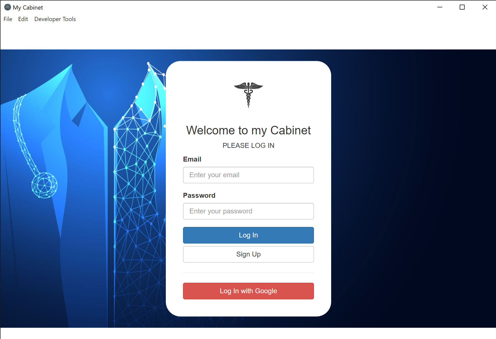
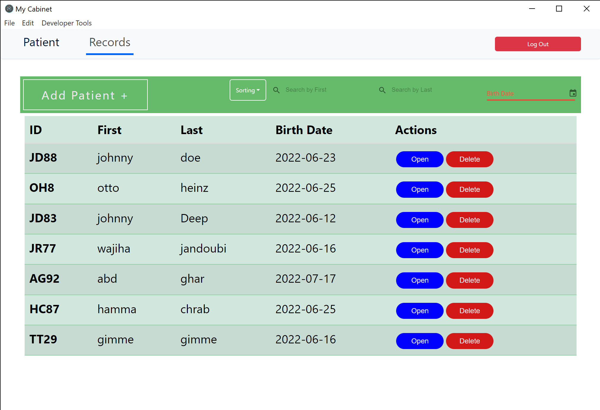
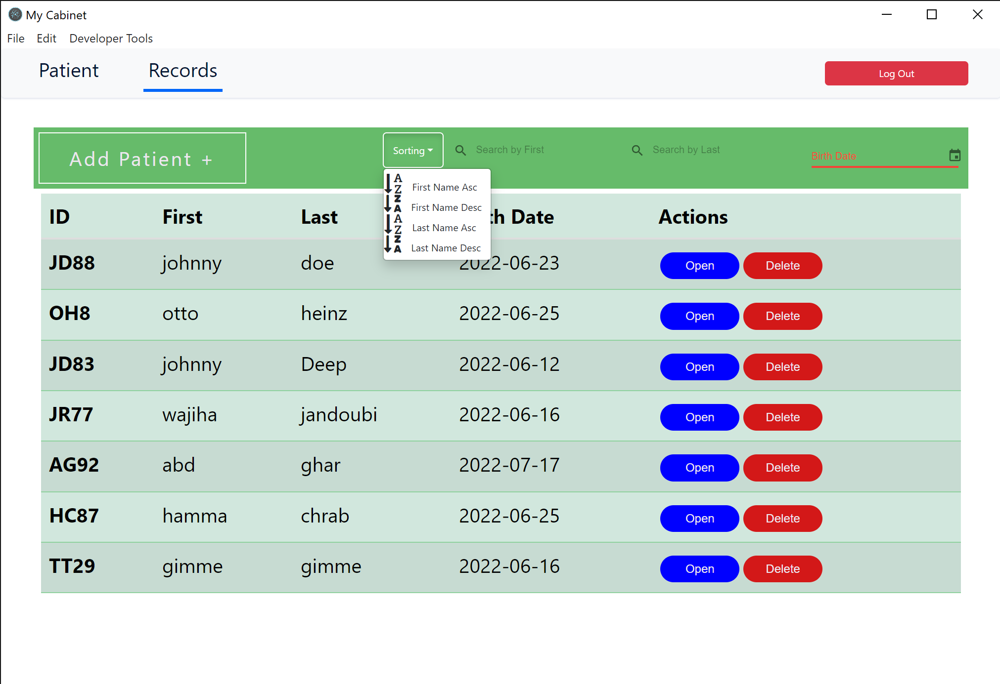
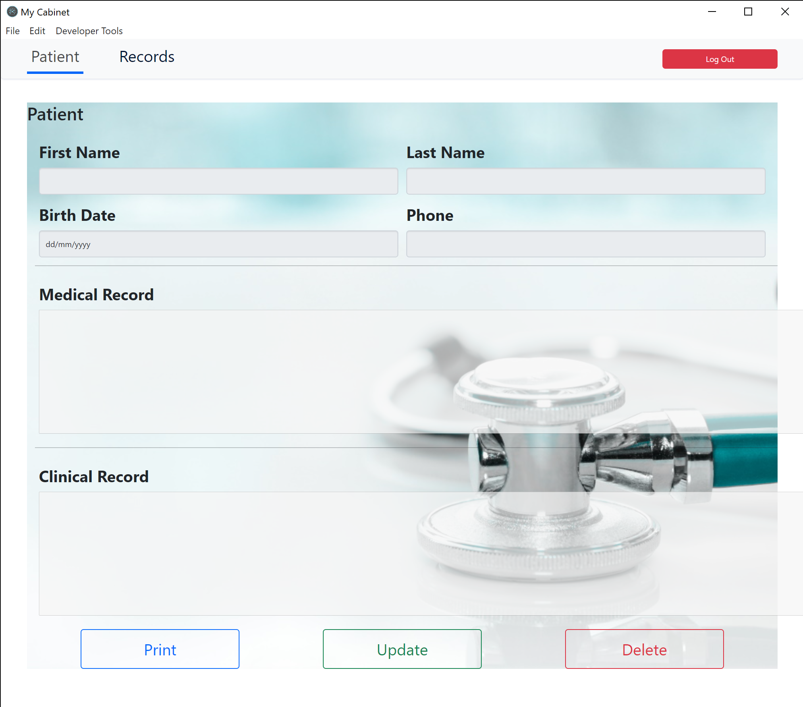
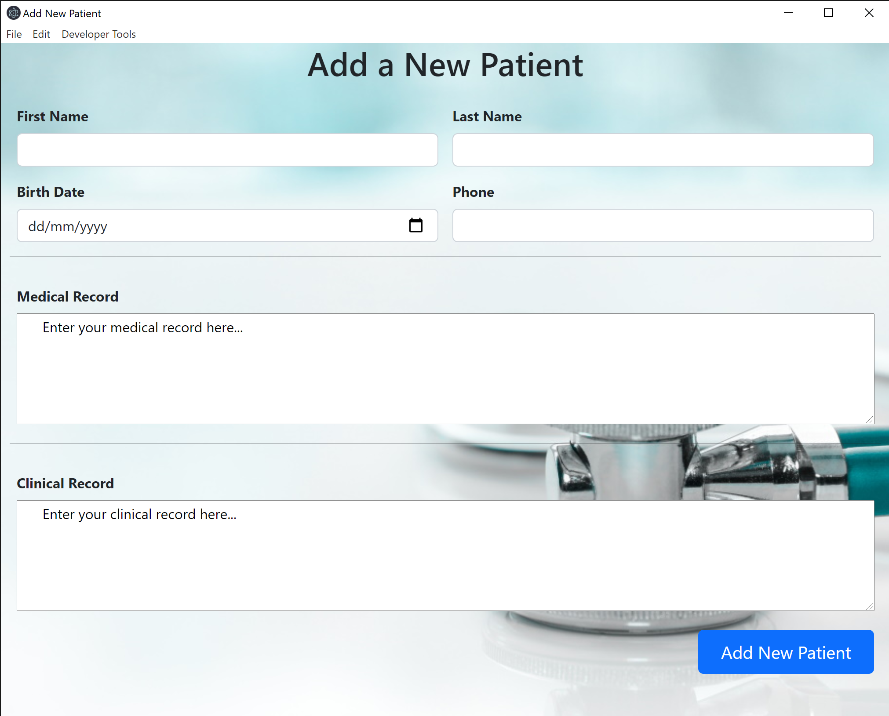

## Getting Started

```bash
git clone https://github.com/TarekAmmar1993/MyCabinet.git
npm install
npm start
```
## Introduction
MyCabinet is a desktop application for managing a doctor's cabinet. The main features are :

- Authentication module
- CRUD operations for patients
- Filter records by first ame, last name or birth date
- Sort records alphabetically 
- Print a record

Here is some Screenshots of MyCabinet :








